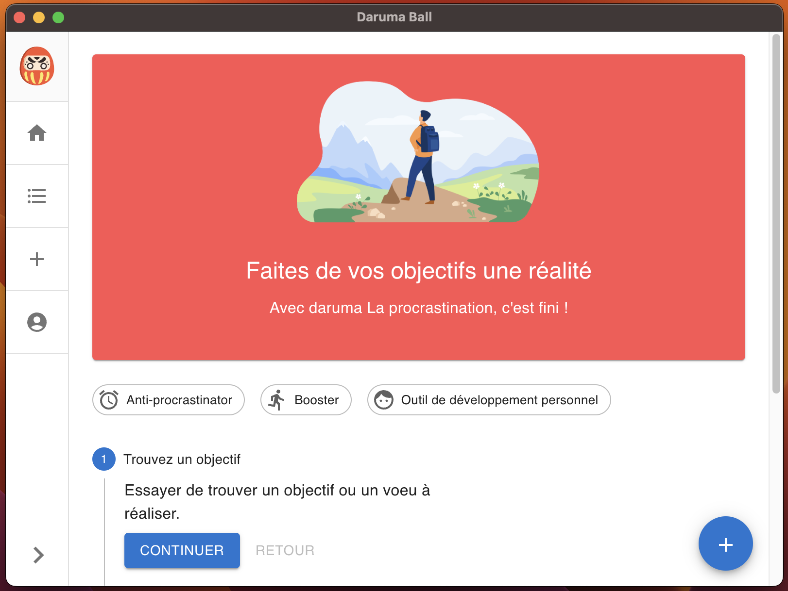
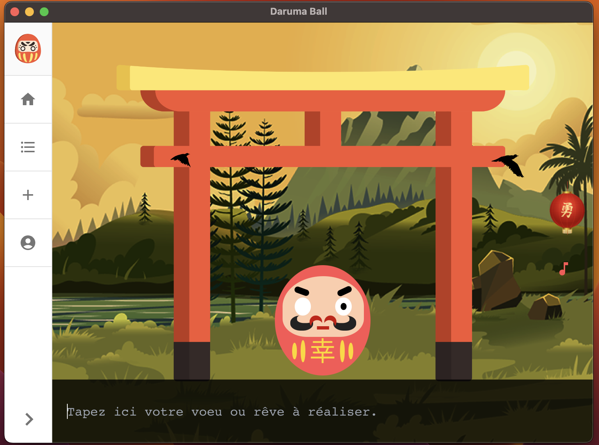

<div align='center'>
  <h1 style='color: #ff7474;'>Daruma Ball</h1>
  
</div>

<br />

<!-- https://shields.io/ -->
<p align="center">
  <a href="https://github.com/facebook/react-native/blob/HEAD/LICENSE">
    
  </a>
  <a href="http://app.daruma-ball.surge.sh/">
    
  </a>
  <a href="http://app.daruma-ball.surge.sh/">
    
  </a>
</p>


### Our Goal : <span style='color: #ff7474'>Transform your to-do list into a done list</span>

#### [Download Desktop app here](https://github.com/Alexon1999/daruma-ball/releases)
#### [Website](http://app.daruma-ball.surge.sh)

# Screens





---

#### Solution Description
- We built an electron app with Electron Forge (is an all-in-one tool for packaging and distributing Electron applications)
  ```
    $ npx create-electron-app daruma-ball
  ```
- Plug the electron app with a React app
  - on react app
  ```
  $ cd app
  $ npm install

  # create two environment files to seperate environments (.env.development.local and .env.production.local) but in realworld deployment use (.env.development and .env.production), see the .env.example
  $ cat .env.example
  ```

  - on root of electron app
  ```
    # development
    $ npm run start

    # production
    # deploy your react app, and put the URL in src/index.js
    $ npm run build
  ```

- Release app
  - **on Github**
    - change the version on package.json, commit and push it. each release is attached to a commit.
  ```
  # create a release github repo
  $ npm run publish
  ```
    - releases will be available [here](https://github.com/Alexon1999/daruma-ball/releases)
    - select a release and publish it.

### Source
- [Electron Forge Getting Started](https://www.electronforge.io/)
- [Configure Electron Forge](https://www.electronforge.io/configuration)
- [Packaging Electron app with Electron Forge](https://www.electronjs.org/docs/latest/tutorial/tutorial-packaging)
- [Code Signing](https://www.electronforge.io/guides/code-signing)
- [Github publisher](https://www.electronforge.io/config/publishers/github)
- [Database and Authentication with Supabase](https://github.com/supabase/examples-archive/tree/76e8b276f7fb58ba65b265a16678e9c72c23a72f/supabase-js-v1/todo-list/react-todo-list)
- [Environment Variable Create-React-APP](https://create-react-app.dev/docs/adding-custom-environment-variables/)