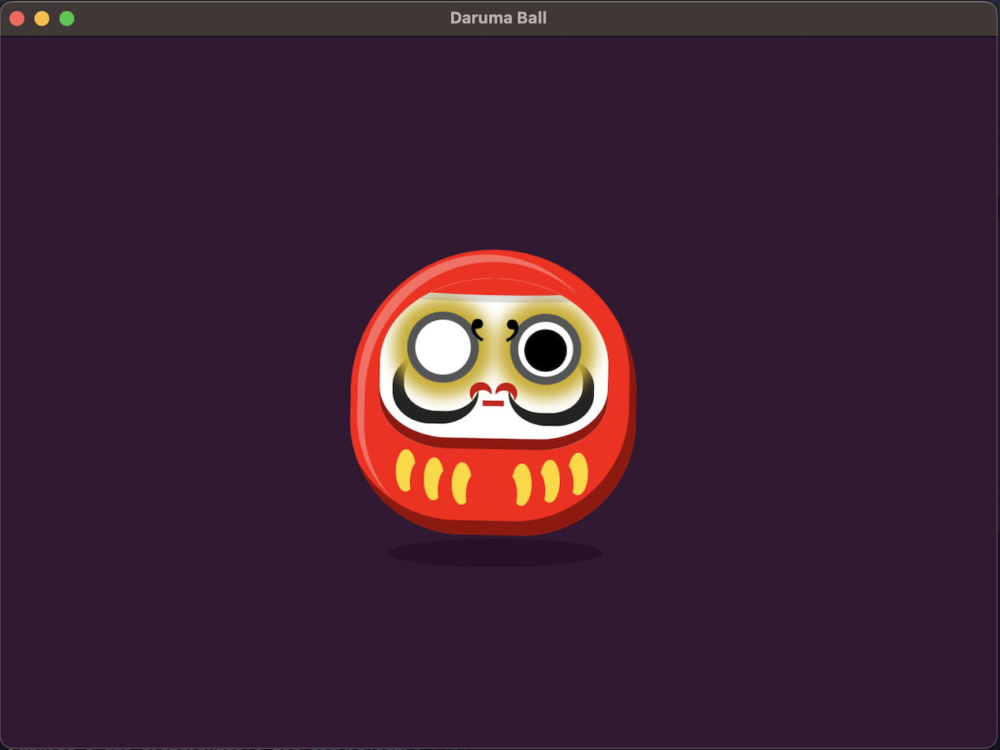
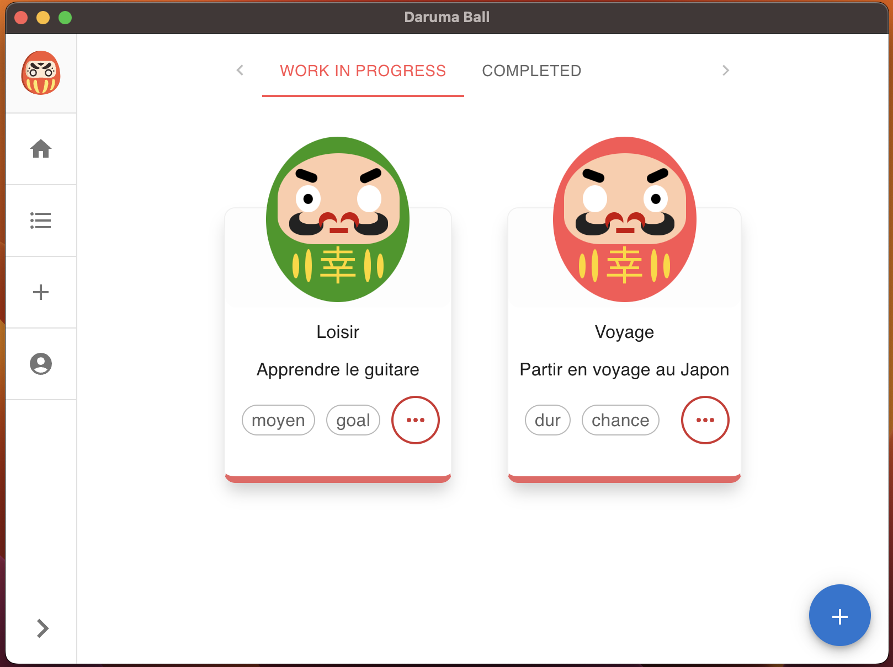

  <h1 style='color: #ff7474;'>Daruma Ball</h1>
  

 

<!-- https://shields.io/ -->

  
  
  
  

### Our Goal : Transform your to-do list into a done list

#### 🚀 Available Here
| Platform | App                                                                                                                           |
| -------- | ----------------------------------------------------------------------------------------------------------------------------- |
| macOS    | [daruma-ball-1.0.7-arm64.dmg](https://github.com/Alexon1999/daruma-ball/releases/download/v1.0.7/daruma-ball-1.0.7-arm64.dmg) |
| windows  | [daruma-ball-1.0.7.Setup.exe](https://github.com/Alexon1999/daruma-ball/releases/download/v1.0.7/daruma-ball-1.0.7.Setup.exe) |
| website  | [daruma-ball.web.app](https://daruma-ball.web.app)                                                                            |

[See all desktop app releases](https://github.com/Alexon1999/daruma-ball/releases)

Want to see new features of the latest version? Please refer to [CHANGELOG](.github/CHANGELOG.md).

## Screens

---

## About the project

Daruma Ball is an open-source project. The concept is to create a to-do list app that uses the traditional Japanese Daruma doll as a way to motivate users to complete their tasks.

## Solution Description
- We built an electron app with Electron Forge (is an all-in-one tool for packaging and distributing Electron applications)
- Plug the electron app with a React app
- Release the app on github using Electron Forge Publisher

If you want to see how it's done, please refer to the [Documentation](docs/dev/README.md)

## Contributing
If you are interested in reporting/fixing issues and contributing directly to the code base, please see [CONTRIBUTING.md](CONTRIBUTING.md) for more information on what we're looking for and how to get started.

##### :bulb: If you have any suggestions for new features or improvements for the app, we would love to hear them [Click here](https://github.com/Alexon1999/daruma-ball/discussions/3).

## License

[MIT](LICENSE)

